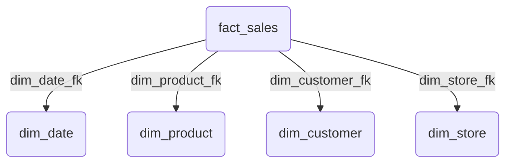
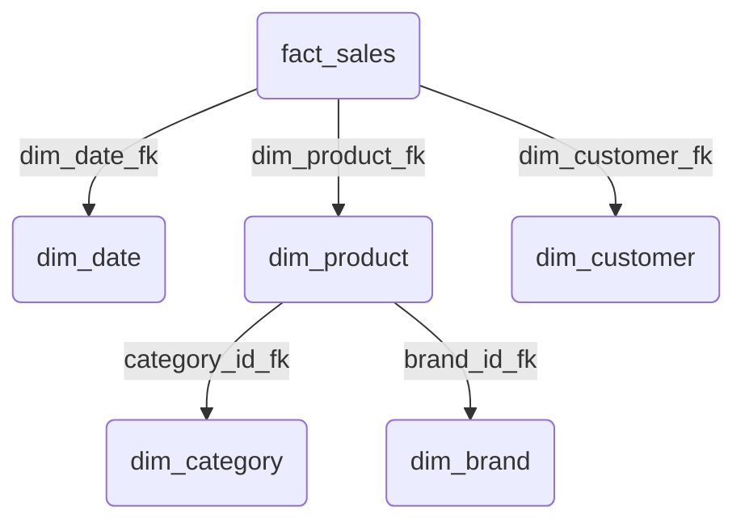

tags: [data-engineering, database, data-modeling, data-warehouse, olap, interviewprep]  
alias: [Схема Звезда, Схема Снежинка, Размерное моделирование, Star Schema, Snowflake Schema]  
related: [[OLAP vs OLTP]], [[Нормализация и Денормализация]], [[Data Warehousing]], [[ETL / ELT Concepts]]

Схема "звезда" и "снежинка" — это две наиболее распространенные модели данных, используемые в [[Data Warehousing|хранилищах данных]] и [[OLAP vs OLTP|OLAP]]-системах. Их основная цель — организовать данные таким образом, чтобы аналитические запросы были быстрыми, а бизнес-логика — интуитивно понятной для аналитиков.

### Основные строительные блоки

Прежде чем разбирать схемы, нужно понять их компоненты:

1. **[[Таблица фактов (Fact Table)]]**
    
    - **Что это?** Центральная таблица в модели. Она хранит **измеряемые, количественные** данные о бизнес-процессе.
        
    - **Что содержит?**
        
        - **Меры (Measures)**: Числовые значения (например, сумма_продажи, количество_товара, стоимость).
            
        - **Внешние ключи (Foreign Keys)**: Ключи, которые ссылаются на таблицы измерений.
            
    - **Аналогия**: Чек из магазина. В нем есть цифры (цена, количество) и ссылки на то, что, где, когда было куплено.
        
2. **[[Таблица измерений (Dimension Table)]]**
    
    - **Что это?** Таблицы, которые описывают **контекст** фактов. Они отвечают на вопросы "кто?", "что?", "где?", "когда?", "как?".
        
    - **Что содержит?** **Атрибуты (Attributes)**: Описательные, текстовые поля (например, название_товара, имя_клиента, адрес_магазина).
        
    - **Аналогия**: Справочники по товарам, клиентам, магазинам.
        

---

## [[Схема Звезда (Star Schema)]]

Это **самый распространенный и рекомендуемый** подход в размерном моделировании.

**Идея**: Одна центральная таблица фактов напрямую соединена с несколькими таблицами измерений. Визуально это напоминает звезду.

**Ключевая особенность**: Таблицы измерений в схеме "звезда" **денормализованы**. Например, измерение "Товары" будет содержать не только ID категории и бренда, но и их текстовые названия (название_категории, название_бренда).

**Диаграмма:**

**(+) Плюсы:**

- **Простота и понятность**: Структура интуитивно понятна для бизнес-аналитиков.
    
- **Высокая производительность запросов**: Для получения всех данных требуется всего **один уровень JOIN** между таблицей фактов и нужными измерениями.
    
- **Оптимизация для BI-инструментов**: Большинство BI-инструментов (Tableau, Power BI) отлично работают со схемой "звезда".
    

**(-) Минусы:**

- **Избыточность данных**: Денормализованные измерения занимают больше места на диске.
    

---

## [[Схема Снежинка (Snowflake Schema)]]

**Идея**: Это дальнейшее развитие схемы "звезда", где **таблицы измерений нормализуются**. Из большого денормализованного измерения выделяются более мелкие, связанные таблицы.

**Ключевая особенность**: Измерение Товары может быть разбито на таблицы Товары, Категории и Бренды, которые связаны между собой. Визуально это напоминает сложную структуру снежинки.

**Диаграмма:**

**(+) Плюсы:**

- **Экономия места**: За счет [[Нормализация и Денормализация|нормализации]] устраняется избыточность в измерениях.
    
- **Простота поддержки измерений**: Если нужно поменять название категории, это делается в одном месте.
    

**(-) Минусы:**

- **Сложность**: Схема становится сложнее для понимания и использования.
    
- **Низкая производительность запросов**: Для получения данных требуется **несколько уровней JOIN** (например, Sales -> Products -> Categories), что значительно замедляет запросы.
    

---

### Сводное сравнение: Звезда vs. Снежинка

|   |   |   |
|---|---|---|
|Характеристика|Схема "Звезда" (Star)|Схема "Снежинка" (Snowflake)|
|**Нормализация измерений**|Денормализованы|Нормализованы|
|**Количество JOIN'ов**|Мало (обычно один)|Много (несколько уровней)|
|**Производительность**|**Высокая**|**Низкая**|
|**Простота для аналитика**|**Высокая**|Низкая|
|**Расход места**|Больше|Меньше|
|**Рекомендация Kimball**|**Предпочтительный выбор**|Использовать с осторожностью|

### Какой подход выбрать? Мнение Kimball Group

Методология Kimball Group, которая является золотым стандартом в проектировании хранилищ данных, **настоятельно рекомендует использовать схему "звезда"**.

**Причина**: Главная цель хранилища данных — **скорость и простота использования для конечного пользователя (аналитика)**. Небольшая экономия дискового пространства за счет "снежинки" не стоит потерь в производительности и усложнения запросов. В современных колоночных базах данных выигрыш в хранении от нормализации еще менее значителен.

---

### Популярные вопросы на собеседовании

- **"В чем разница между таблицей фактов и таблицей измерений?"**
    
- **"Опишите схему 'звезда'. Каковы ее преимущества?"**
    
- **"Почему схему 'снежинка' обычно не рекомендуют использовать?"**
    
    - Ответ: Потому что она усложняет запросы и снижает их производительность из-за необходимости в дополнительных JOIN'ах, что является критичным для аналитических систем. Простота и скорость "звезды" обычно важнее.
        
- **"Представьте, что вы проектируете витрину данных для анализа логов веб-сайта. Какие у вас будут факты и измерения?"**
    
    - Ответ: Таблица фактов будет содержать меры, такие как количество_просмотров, длительность_сессии. Измерениями будут Дата/Время, Пользователь (с атрибутами: страна, город), Страница (с атрибутами: URL, заголовок), Тип устройства.